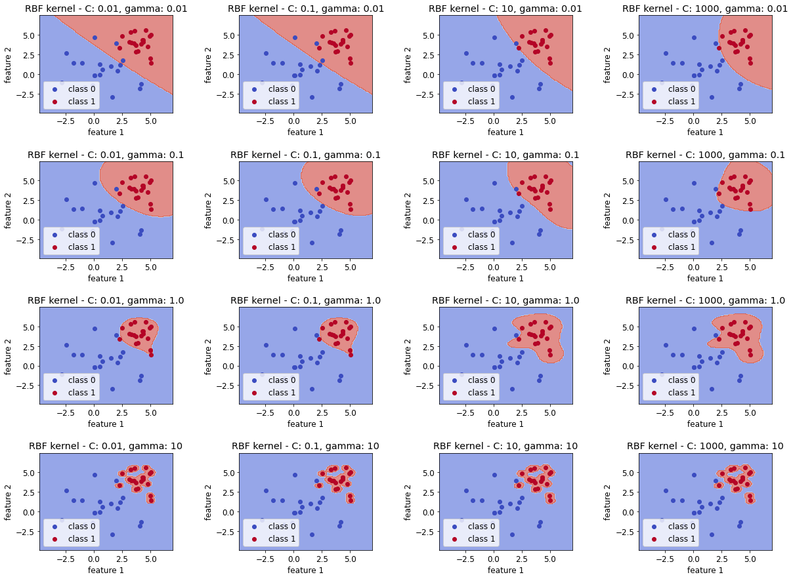

# Visualization Decision Surfaces
Different parameters (e.g. when training a SVM) lead to different effects on the decision boundaries.
Multiple SVMs are trained on a random data set, which differ in the applied parameter values of C, gamma and the applied kernel.

